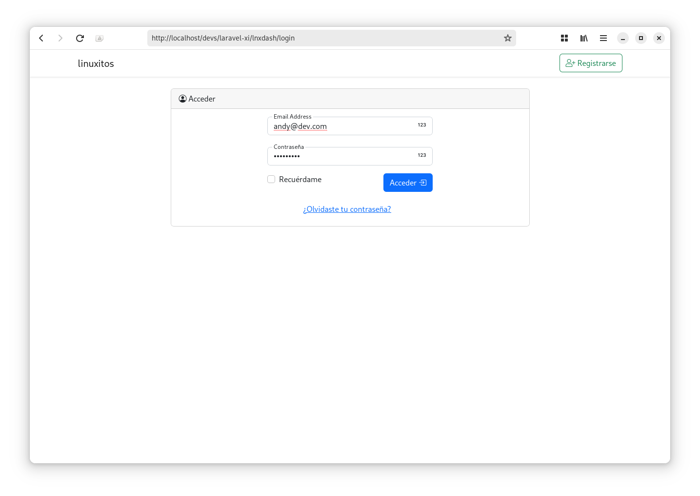
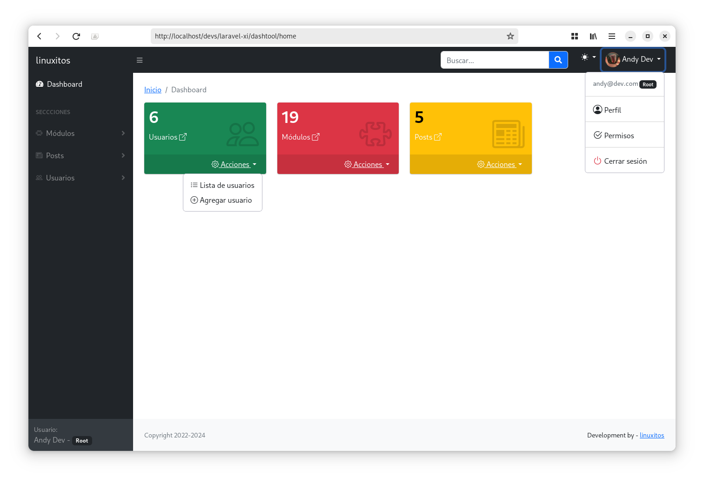

# DashTool

## Descripción

Un dashboar utilizando Laravel 11 con algunas características esenciales desarrolladas a mi manera. Éste proyecto lo utilicé como parte de la facultad, por lo que sólo lo actualicé a la versión más reciente de Laravel, para compartirlo con ustedes.

## Funcionalidades

- Control de permisos
- Control de usuario
- Control de módulos
- Uso ajax
- PHP > 8.2
- Buscador con ajax
- Login
- Registro
- Recuperación de contraseña
- Uso de imágenes

## Capturas

## MIT License

License: MIT

#### Developed By
----------------
 * linuxitos - <contact@linuxitos.com>